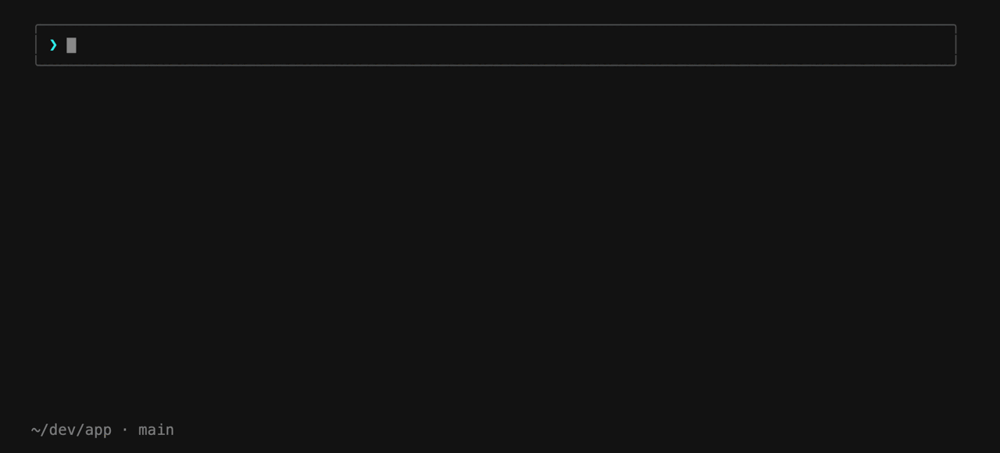

# claude-media-control

[](https://github.com/Bangs00/claude-media-control/actions/workflows/ci.yml)
[](LICENSE)


[English](README.md) | [한국어](README.ko.md) | **日本語** | [简体中文](README.zh-CN.md)

Spotify、Apple Music、ブラウザ、VLC ——**Mac でいま何が再生されていても**、
Claude Code からそのまま確認・操作できます。「今かかってる曲は？」と聞く、
「音楽を一時停止して」と頼む、インタラクティブなリモコンを開く——ぜんぶ
できます。OAuth も API キーもアプリごとの連携設定も要りません。**Homebrew で
インストールするものもありません**。



## このプラグインならではの点

既存の Claude 向け Spotify / Apple Music 連携は、どれも特定のアプリ専用で、
OAuth や AppleScript のセットアップが前提です。このプラグインは **macOS の
システム全体の now-playing サービス**と直接やり取りするため、どのアプリで
再生していても、*いまアクティブな*プレイヤーをそのまま認識して操作できます。
サードパーティ依存もゼロ。必要なのは Xcode Command Line Tools だけで、
`git clone` が使える環境なら、まず間違いなくインストール済みです
（[要件](#要件)を参照）。

## インストール

Claude Code の中で 2 行だけ。Homebrew の手順はありません:

```
/plugin marketplace add Bangs00/claude-media-control
/plugin install media@claude-media-control
```

最初に media コマンドを実行したときに、小さな native helper を一度だけ
ビルドします（約 2 秒）。以降はキャッシュが使われます。macOS 専用です。

## 使い方

自然言語でも、slash command でも、インタラクティブメニューでも操作できます:

| こう話しかけると | …またはこれを実行 | どうなるか |
| --- | --- | --- |
| 「今かかってる曲は？」 | `/media:now` | 曲名 / アーティスト / アプリ + プログレスバーを表示 |
| 「音楽を止めて」 | `/media:pause` · `/media:toggle` | 再生中のプレイヤーを一時停止 / 再開 |
| 「次の曲にして」 | `/media:next` · `/media:prev` | 次の曲 / 前の曲 |
| 「1:30 に飛ばして」 | `/media:seek 1:30` | 指定した位置へシーク |
| 「アルバムアートを見せて」 | `/media:artwork` | ジャケット画像を保存して表示 |
| 「音量を下げて」 | `/media:volume 30` | システム音量の確認 / 変更（0–100） |
| 「さっき流れてた曲は？」 | `/media:history` | 最近再生された曲の一覧（ローカル記録） |
| 「AirPods で流して」 | `/media:output airpods` | オーディオ出力デバイスの確認 / 切り替え |
| 「リモコンを出して」 | `/media:menu` | 矢印キーで操作するインタラクティブコントローラ |
| 「ステータスラインの並びを変えて」・「曲名をシアンにして」 | `/media:statusline` | ステータスラインのハブ——項目のオン / オフ、数字パターンでの配置、パーツごとのスタイルまで一か所で |
| 「履歴をオフにして」 | `/media:config` | クイック設定——ステータスライン、`/media:now` のプログレスバー、履歴のオン / オフ + ステータスラインのリセット |
| — | `/media:doctor` | ビルド / 権限 / フォールバックの診断 |

ステータスラインに再生中の曲を出すこともできます——設定は完全に自動、
コマンド 1 つで済みます:

```
▶︎ Karma Police — Radiohead (Spotify)  🔉 ▄ 45%
━━━━━━────  2:13/4:24  🎧 AirPods Pro
```

- **オンにするのは `/media:config display.statusline on`** です
  （`/media:statusline` で配置を決めても一緒にオンになります）。オンにした
  時点でセグメントは `settings.json` に自動で配線されます——既存の
  ステータスラインはそのまま動き続け、再生情報は独立した 1 行として
  追加されるだけです。以前の `statusLine` の値はバックアップされ、
  **プラグインをアンインストールすると自動で復元されます**。再起動も
  手作業の手順も不要です（詳しい動作と設計上の保証:
  [docs/statusline.ja.md](docs/statusline.ja.md)）。
- **クリックで操作できます**——ハイパーリンク対応ターミナル（iTerm2、
  Ghostty、WezTerm、Kitty、VS Code など）ではセグメントが **⌘+クリック**に
  反応します: ▶︎/⏸ アイコンは再生/一時停止、タイトル—アーティストは再生中
  アプリへ移動、プログレスバーはセル単位でその位置へシーク。OSC 8 リンクと
  ローカルの `claude-media://` ハンドラアプリで動きます——macOS 標準ツール
  だけで生成、自動登録、アンインストール時に削除。未対応ターミナルでは
  ただの通常セグメントとして表示されます。オフにするには
  `/media:config statusline.links off`（詳細:
  [docs/statusline.ja.md](docs/statusline.ja.md)）。
- **自分好みにするのは `/media:statusline`** — 項目のオン / オフ、レイアウト
  選択や `123/456` のような数字パターンでの配置（数字が項目——曲情報、
  アプリ、音量、プログレスバー、時間、出力デバイス——で、`/` が改行）、
  そしてパーツごとのスタイルまで変えられます: 太字/斜体/色、再生・一時停止
  のアクセント色、バーの文字（デフォルト `line` `━━──` から `smooth` の
  部分ブロック、`knob` のつまみ、再生中に流れる `wave`・`pulse`・`eq`・
  `notes` まで 14 種のプリセット。任意の 2 文字も可）、
  音量アイコンとバーの形
  （`block`/`progress`/`stairs`）、出力デバイスのアイコン——さらに `off` で
  どのパーツでも非表示にできます。
- 長いタイトルはマーキー式にスクロールします。音量の項目はアイコン + 音量に
  応じた高さのバー + パーセント（`🔉 ▄ 45%`）で、出力デバイスのアイコンは
  デバイスの種類に合わせて（`🎧` Bluetooth、`📺` HDMI、`📶` AirPlay、`🔊`
  スピーカー）表示されます。色は標準 16 色 SGR のみ——プレーンテキストに
  戻すには `/media:config statusline.color off`（または `NO_COLOR`）を
  使ってください。
- オン / オフのクイック切り替えと**ステータスラインのリセット**は
  `/media:config` にあります。キーは `reset` で個別にも戻せます。

## 仕組み

macOS には、他のアプリの再生情報を読み取る公開 API がありません。非公開の
`MediaRemote` フレームワークにはその機能がありますが、macOS 15.4 以降、
このデーモンは Apple が署名したプロセスにしか応答しません。そこでこの
プラグインは
[ungive/mediaremote-adapter](https://github.com/ungive/mediaremote-adapter)
と同じ手法を使っています。小さな Objective-C ヘルパー
（`native/adapter.m`）を、Apple のプラットフォームバイナリである
`/usr/bin/perl` にロードさせることで、entitlement チェックを通過する仕組み
です。再生操作とシークも同じ経路で処理します。

native helper をビルドできない環境では（Command Line Tools がない場合）、
読み取りはコンパイル不要の `osascript`/JXA に、Spotify と Apple Music の
操作はアプリごとの AppleScript にフォールバックします。いまどのモードで
動いているかは `/media:doctor` が教えてくれます。

> **免責事項。** このプラグインは**非公開かつドキュメント化されていない
> Apple のフレームワーク**に依存しています。現時点では macOS 26.x で動作し、
> macOS アップデートのたびに自動で再検証されます（ビルドキャッシュは OS の
> ビルド番号がキー）が、Apple がいつ仕様を変えたり塞いだりしても不思議は
> ありません。その場合、プラグインはフォールバック経路に切り替わって動作を
> 続け、`/media:doctor` が状況を報告します。無保証です——[LICENSE](LICENSE)
> を参照してください。

## 再生履歴と出力デバイス

`/media:history` は最近再生された曲を新しい順に一覧表示します。記録は
どのみち行われる読み取り（ステータスラインの更新、`/media:now`、再生
コマンド）に**相乗りして**残るため、バックグラウンドのポーリングもデーモンも
追加のリソース負荷もありません。ログはプラグインのデータディレクトリに
最新 500 曲まで保存され、マシンの外に出ることは決してありません。
`/media:config history.record off` で記録を止め、`/media:history clear` で
消去できます。

`/media:output` はオーディオ出力デバイスの一覧表示と切り替えを行います
（「AirPods で流して」）——公開の CoreAudio API を使うので追加の権限は
不要です。ステータスラインに現在のデバイスを出すこともできます:
`/media:statusline` の Items タブで「Output device」にチェックを入れるか、
数字パターンで好きな位置に配置してください。

## 要件

- **macOS**（macOS 26.x / Apple Silicon でテスト済み。この手法は 15.4 以降が
  対象です）。ほかの OS はロードマップにあります。
- **Xcode Command Line Tools**——初回の native ビルドに必要です。
  `xcode-select --install` でインストールできますが、おそらくもう入って
  います。プラグインの取得に必要な `git` が、`clang` と同じ Command Line
  Tools に含まれているからです。なくてもプラグインはフォールバックモードで
  動きます。

Homebrew も Node も Python も API キーも要りません。

## インストールの確認

```
/media:doctor
```

正常にインストールできていれば `verdict: PRIMARY OK` で終わります。
`DEGRADED` と出た場合は、レポートが対処法を教えてくれます（たいていは
`xcode-select --install` してから `/media:doctor --rebuild`）。

## トラブルシューティング

| 症状 | 対処 |
| --- | --- |
| `DEGRADED — native helper unavailable` | `xcode-select --install` のあと `/media:doctor --rebuild` |
| macOS アップデート後に `PRIMARY READ LIKELY BLOCKED` | `/media:doctor --rebuild`。直らなければ [issue を立ててください](https://github.com/Bangs00/claude-media-control/issues) |
| AppleScript の操作が **error -1743** で失敗する | システム設定 → プライバシーとセキュリティ → オートメーションでターミナルアプリを許可（フォールバックモードのみ） |
| 何も再生していないのに `now` が曲を表示する | アプリが古い状態を報告しています。`/media:next` を試すか、プレイヤーを再起動してください |

ビルドログは `${CLAUDE_PLUGIN_DATA}/build.log` にあります。

## アンインストール

```
/plugin uninstall media@claude-media-control
/plugin marketplace remove claude-media-control
```

これで**マシンはインストール前の状態に完全に戻ります。** プラグインが作る
ものはすべて、Claude が管理する 2 つのディレクトリ
（`~/.claude/plugins/cache/...` と `~/.claude/plugins/data/...`）の中だけに
あり、どちらも Claude Code が片づけます。LaunchAgent も、ログイン項目も、
システムパッケージもありません。一時的なジャケット画像は `$TMPDIR` に
置かれ、macOS が自動で消します。

唯一の例外は意図的なもので、自ら元に戻ります: **ステータスライン**の
セグメントをオンにしていた場合、プラグインは `settings.json` のキーを
ちょうど 1 つ（`statusLine`。必ず以前の値をバックアップしてから）編集して
います。Claude Code にはアンインストールフックがないため、ステータスライン
のラッパーは自己修復型です——アンインストール後、最初のステータスラインの
更新で以前の `statusLine` を復元し、自分自身とバックアップを削除し、
`claude-media://` クリックハンドラアプリも登録解除して消します。
1 秒以内に、ステータスラインは元の姿そのままに戻ります
（[docs/statusline.ja.md](docs/statusline.ja.md) を参照）。

プラグインのファイルではないため残ることがあるものが 2 つあります
（どちらも無害です）:

- AppleScript フォールバックを使った場合、macOS は**オートメーションの許可**
  （「ターミナル → Spotify/Music」）をシステムの権限データベースに残します。
  消したければ `tccutil reset AppleEvents` を実行してください。
- ステータスラインを**手作業で**配線していた場合
  （`docs/statusline.ja.md` の手動セットアップのレシピ）、そのファイルは
  ユーザーのものです: セグメントは自然に消えますが、ラッパーの削除と
  `"statusLine"` の値の復元は自分で行ってください。

## ロードマップ

- **Linux** 対応——`playerctl`/MPRIS ベース。ディスパッチャはすでに OS ごとの
  バックエンド構成になっています。コントリビューション歓迎。
- **Windows** 対応——SMTC（`GlobalSystemMediaTransportControls`）ベース。
  コントリビューション歓迎。

## 開発

```bash
claude --plugin-dir .          # チェックアウトからプラグインをロード
shellcheck scripts/*.sh        # lint
npx bats tests/media.bats      # ユニットテスト（native はスタブ化）
claude plugin validate . --strict
```

CI では上記すべてに加えて、macOS ランナーで strict モードの native ビルドも
実行しています。

## ライセンス

[MIT](LICENSE) です。native adapter は ungive/mediaremote-adapter の
BSD-3-Clause の手法を移植し、ungive/media-control の CLI/JSON の慣例を
参考にしています——[native/NOTICE](native/NOTICE) を参照してください。
