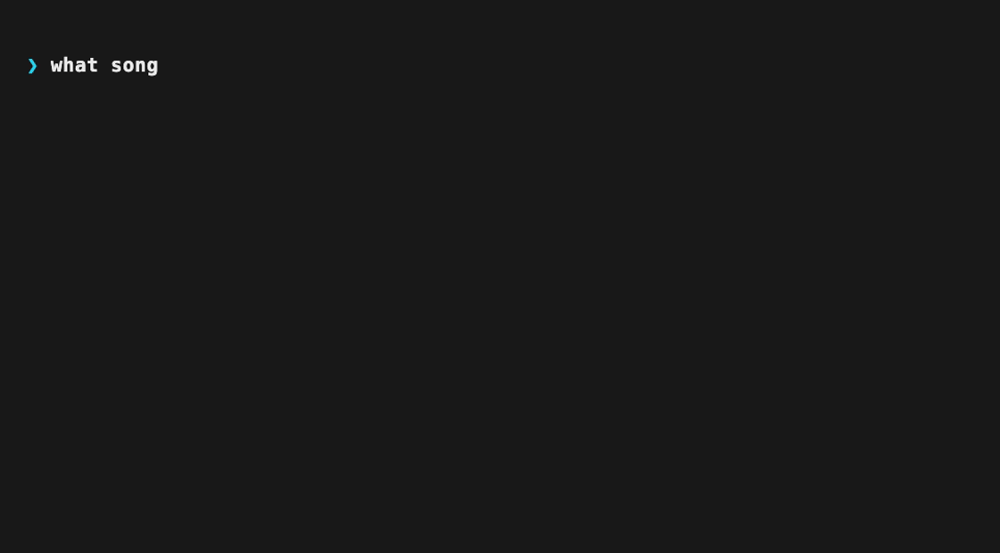

# claude-media-control

[](https://github.com/Bangs00/claude-media-control/actions/workflows/ci.yml)
[](LICENSE)


**English** | [한국어](README.ko.md) | [日本語](README.ja.md) | [简体中文](README.zh-CN.md)

See and control **whatever is playing on your Mac** — Spotify, Apple Music,
browsers, VLC — right from Claude Code. Ask "what song is this?", say "pause
the music", or open an interactive remote. No OAuth, no API keys, no per-app
integrations, and **nothing to install with Homebrew**.



## Why this one

The existing Claude/Spotify/Apple-Music integrations each lock you into one
app and an OAuth/AppleScript setup. This plugin talks to the **macOS
system-wide now-playing service**, so it sees and controls the *currently
active* player no matter which app it is — with **zero third-party
dependencies**. The only requirement is the Xcode Command Line Tools, which
you already have if you can `git clone` (see [Requirements](#requirements)).

## Install

Two lines inside Claude Code — no Homebrew step:

```
/plugin marketplace add Bangs00/claude-media-control
/plugin install media@claude-media-control
```

The first media command builds a tiny native helper (~2s, once); after that
it is cached. macOS only.

## Usage

Natural language, slash commands, or an interactive menu — all work:

| Say this | …or run | What happens |
| --- | --- | --- |
| "what song is playing?" | `/media:now` | current title / artist / app + progress bar |
| "pause the music" | `/media:pause` · `/media:toggle` | pause / resume the active player |
| "next track" | `/media:next` · `/media:prev` | skip / go back |
| "jump to 1:30" | `/media:seek 1:30` | seek to an absolute position |
| "show the album art" | `/media:artwork` | saves the cover and displays it |
| "show an audio spectrum" | `/media:spectrum` | live frequency bars of what's playing (opt-in) |
| "turn it down" | `/media:volume 30` | read / set system output volume (0–100) |
| "give me a remote" | `/media:menu` | interactive controller (arrow-key menu) |
| — | `/media:statusline` | choose what the now-playing statusline shows + layout |
| — | `/media:config` | toggle display features (progress bar, statusline, spectrum) |
| — | `/media:doctor` | diagnose build / permissions / fallbacks |

Optional: put now-playing in your statusline — see
[docs/statusline.md](docs/statusline.md). Pick which items appear (track,
progress bar, time, spectrum) and whether they stack on separate lines with
`/media:statusline`. The segment comes ANSI-styled — state-colored icon and
progress bar, bold title, italic artist, tinted spectrum (solid color or a
positional rainbow via `spectrum.style`) — and
`/media:config statusline.color off` (or `NO_COLOR`) restores plain text.

## How it works

macOS has no public API to read another app's now-playing info; the private
`MediaRemote` framework does, but since macOS 15.4 its daemon only answers
processes signed by Apple. This plugin uses the same technique as
[ungive/mediaremote-adapter](https://github.com/ungive/mediaremote-adapter):
a small Objective-C helper (`native/adapter.m`) is loaded by
`/usr/bin/perl` — an Apple platform binary — which passes the entitlement
check. Playback commands and seeking go through the same path.

If the native helper can't build (no Command Line Tools), the plugin falls
back to a compile-free read via `osascript`/JXA, and to per-app AppleScript
for control of Spotify and Apple Music. `/media:doctor` tells you which mode
you're in.

> **Disclaimer.** This relies on a **private, undocumented Apple framework**.
> It works today on macOS 26.x and is re-validated automatically after every
> macOS update (the build cache is keyed on the OS build number), but Apple
> could change or block it at any time. When that happens the plugin degrades
> to the fallback paths and `/media:doctor` reports it. No warranty — see
> [LICENSE](LICENSE).

## Audio spectrum (opt-in)

`/media:spectrum` renders a live frequency-bar view of whatever is playing:

```
63Hz ▂▄▆█▇▅▃▂ ▃▂▁▁ ▁ 16kHz   (peak: 1.2kHz)
```

`--live <seconds>` streams several frames, and you can add a mini spectrum to
your statusline with `/media:statusline`.

The bars are tinted `spectrum.color` (default cyan) — or set
`/media:config spectrum.style rainbow` for a front-to-back color cycle by bar
position (deliberately not loudness-driven). The tint shows in the statusline
and in direct terminal runs; chat replies keep plain glyphs.

**How it captures audio.** A Core Audio *process tap*
(`AudioHardwareCreateProcessTap`, a public API since macOS 14.4) reads the
system output mix; a local Accelerate/vDSP FFT turns it into bands. **The audio
never leaves your machine** — only the bar string is produced, nothing is
recorded or transmitted.

**Off by default.** A music-control plugin asking for audio recording deserves
scrutiny, so the spectrum is opt-in:

```
/media:config display.spectrum on
```

**Permission.** The tap needs the *system audio recording* permission on your
terminal app. macOS does **not** show an automatic prompt for command-line
tools, so grant it manually: System Settings > Privacy & Security > Screen &
System Audio Recording, enable your terminal (Terminal, iTerm, …) with audio
playing. Enabling is fail-closed — if the capture is silent while audio plays it
refuses and points you at the missing grant; if the grant is later revoked the
feature disables itself. `/media:doctor` reports the permission state.

Requires macOS 14.4+; on older systems the feature stays hidden and the helper
is never compiled.

## Requirements

- **macOS** (tested on macOS 26.x / Apple Silicon; the technique targets
  15.4+). Other OSes are on the roadmap.
- **Xcode Command Line Tools** — for the one-time native build. Install with
  `xcode-select --install`. You almost certainly already have them: cloning
  a plugin needs `git`, which ships with the same Command Line Tools as
  `clang`. Without them the plugin still runs in fallback mode.

No Homebrew, no Node, no Python, no API keys.

## Verify installation

```
/media:doctor
```

A healthy install ends with `verdict: PRIMARY OK`. If it says `DEGRADED`,
the report names the fix (usually `xcode-select --install`, then
`/media:doctor --rebuild`).

## Troubleshooting

| Symptom | Fix |
| --- | --- |
| `DEGRADED — native helper unavailable` | `xcode-select --install`, then `/media:doctor --rebuild` |
| `PRIMARY READ LIKELY BLOCKED` after a macOS update | `/media:doctor --rebuild`; if it persists, please [open an issue](https://github.com/Bangs00/claude-media-control/issues) |
| AppleScript control fails with **error -1743** | approve your terminal app under System Settings → Privacy & Security → Automation (fallback mode only) |
| Nothing plays but `now` shows a track | the app reported stale state; try `/media:next` or restart the player |
| Spectrum is silent, or `display.spectrum on` is refused | grant **system audio recording** to your terminal app under System Settings → Privacy & Security (with audio playing), then retry; `/media:doctor` shows the state |

Build logs live at `${CLAUDE_PLUGIN_DATA}/build.log`.

## Uninstall

```
/plugin uninstall media@claude-media-control
/plugin marketplace remove claude-media-control
```

This **fully reverts your machine to its pre-install state.** Everything the
plugin creates lives in two Claude-managed directories
(`~/.claude/plugins/cache/...` and `~/.claude/plugins/data/...`), both removed
on uninstall — no LaunchAgents, no login items, no home-directory files, no
`settings.json` edits, no system packages. The plugin never writes anywhere
else; temporary artwork goes to `$TMPDIR`, which macOS clears on its own.

Two things are *not* plugin files and may remain (both harmless):

- If you used the AppleScript fallback, macOS keeps its **Automation approval**
  ("terminal → Spotify/Music") in the system permission database. Clear it
  with `tccutil reset AppleEvents` if you like.
- If you added the optional statusline wrapper, remove
  `~/.claude/statusline-media.sh` and restore your previous `"statusLine"`
  value in `settings.json`.

## Roadmap

- ~~**Audio spectrum** (`/media:spectrum`)~~ — shipped in v0.2.0 (see above).
- **Linux** backend via `playerctl`/MPRIS — the dispatcher is already
  structured for per-OS backends; contributions welcome.
- **Windows** backend via SMTC (`GlobalSystemMediaTransportControls`) —
  contributions welcome.

## Development

```bash
claude --plugin-dir .          # load the plugin from a checkout
shellcheck scripts/*.sh        # lint
npx bats tests/media.bats      # unit tests (native stubbed out)
claude plugin validate . --strict
```

CI runs all of the above plus a strict native build on a macOS runner.

## License

[MIT](LICENSE). The native adapter ports BSD-3-Clause techniques from
ungive/mediaremote-adapter and references CLI/JSON conventions from
ungive/media-control — see [native/NOTICE](native/NOTICE).
