# 状态栏现成搭配

[English](recipes.md) | [한국어](recipes.ko.md) | [日本語](recipes.ja.md) | **简体中文**

现成的 now-playing 组件整套外观，直接粘贴即用。每一款都源自你认得出的
原型——荧光体终端、磁带卡座、调谐刻度盘、调音台。颜色也取自原型本身：
荧光体的发射谱线、颜料、有据可查的标准。下面每条命令都通过了真实的
`media.sh config` 校验，每张 GIF 都是渲染器的真实输出（每秒 1 帧）。
（全程使用虚构曲目——*Modem Chorus* 的 *Rented Sunsets*，在虚构应用
*Aux* 中播放。）

应用方法：把代码块里的命令一行行发给 Claude，或整块交给它说"照这个
设置"。改动会在下一次状态栏刷新时生效——无需重启。

每款搭配都以**出厂状态**为起点。若刚用过别的搭配或自己改过样式，先
重置——退出任何搭配也是同一条命令：

```
/media:config statusline reset
```

（逐键说明见[样式图鉴](styles.zh-CN.md)；重置系列见
[恢复默认](styles.zh-CN.md#恢复默认)。）

十六进制色以 24-bit truecolor 渲染——多数终端支持，Apple Terminal
不支持。[Twilight](#twilight) 结尾给出了适用于任何搭配的 named-color
替换方案。

## Zen

只留标题和当前位置——连 marquee 也关掉，会动的只有时钟。

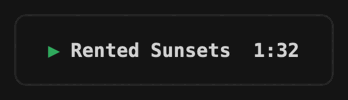

```
/media:config statusline.fields "track,time"
/media:config style.track.artist off
/media:config style.time.total off
/media:config statusline.marquee off
```

```
▶︎ Rented Sunsets  1:32
```

## Mono

黑底白字配一条细 line 进度条——口袋播放器 OLED 的外观，只用 named
color。

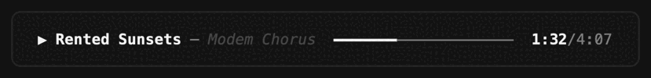

```
/media:config statusline.fields "track,progressbar,time"
/media:config style.progressbar.playing bright-white
/media:config style.progressbar.paused bright-black
/media:config style.track.title "bold bright-white"
/media:config style.track.artist "italic bright-black"
/media:config style.time.elapsed "bold bright-white"
/media:config style.time.total "dim white"
```

```
▶︎ Rented Sunsets — Modem Chorus  ━━━━━━━─────────────  1:32/4:07
```

## Hardcopy

纯 ASCII、零颜色，像一份打印出来的终端日志——适合朴素终端和
`NO_COLOR` 环境。

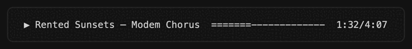

```
/media:config statusline.fields "track,progressbar,time"
/media:config style.progressbar.style retro
/media:config statusline.color off
/media:config statusline.marquee off
```

```
▶︎ Rented Sunsets — Modem Chorus  =======-------------  1:32/4:07
```

## Plasma

近乎全黑的底上一格格橙色——氖气等离子面板。一格要么亮要么不亮，中间
没有过渡。

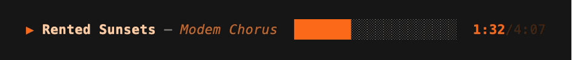

```
/media:config statusline.fields "track,progressbar,time"
/media:config style.progressbar.style blocks
/media:config style.progressbar.playing "#ff6a1a"
/media:config style.progressbar.paused "#a34410"
/media:config style.track.title "bold #ffcba3"
/media:config style.track.artist "italic #c26a2e"
/media:config style.time.elapsed "bold #ff6a1a"
/media:config style.time.total "dim #7a3a12"
```

```
▶︎ Rented Sunsets — Modem Chorus  ███████░░░░░░░░░░░░░  1:32/4:07
```

这抹橙是氖自己的颜色——它在可见光里最强的两条谱线落在 585 nm 和
640 nm。把进度条换成 `rise`、`fade` 或 `corner`，同样的填充就不再以整格
推进，而是按八分之一、三分之一、四分之一格生长；要这块面板的点阵版本，
用 `braille`（它的子格孪生是 `stipple`）。

## Phosphor

黑底绿字的单色配实心方块条——绿色荧光体 CRT 终端。

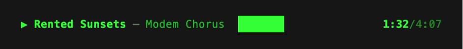

```
/media:config statusline.fields "track,progressbar,time"
/media:config style.progressbar.style "█ "
/media:config style.progressbar.playing "#33ff33"
/media:config style.progressbar.paused "#22aa22"
/media:config style.track.title "bold #33ff33"
/media:config style.track.artist "#22bb33"
/media:config style.time.elapsed "bold #33ff33"
/media:config style.time.total "dim #33ff33"
```

```
▶︎ Rented Sunsets — Modem Chorus  ███████               1:32/4:07
```

想要琥珀色荧光体那位表亲，把 `#33ff33`/`#22bb33`/`#22aa22` 换成
`#ffb000`/`#cc8400`/`#996300`。

## Goban

板岩的黑对蛤壳的白——围棋子。黑子看着偏小，所以特意多削出 0.3 mm，
让两者看起来一样大。

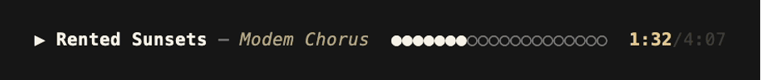

```
/media:config statusline.fields "track,progressbar,time"
/media:config style.progressbar.style dots
/media:config style.progressbar.playing "#f7f3e8"
/media:config style.progressbar.paused "#8a8578"
/media:config style.track.title "bold #f7f3e8"
/media:config style.track.artist "italic #b5a882"
/media:config style.time.elapsed "bold #e8c88a"
/media:config style.time.total "dim #6b6455"
```

```
▶︎ Rented Sunsets — Modem Chorus  ●●●●●●●○○○○○○○○○○○○○  1:32/4:07
```

## Service

毛呢上的金线——袖章上的 V 形条。自 1777 年起它只表示一件事：服役的时间。

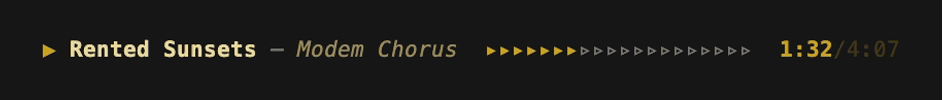

```
/media:config statusline.fields "track,progressbar,time"
/media:config style.progressbar.style chevron
/media:config style.progressbar.playing "#c9a227"
/media:config style.progressbar.paused "#8a6f1e"
/media:config style.track.title "bold #e8d9a0"
/media:config style.track.artist "italic #9a8b5e"
/media:config style.time.elapsed "bold #c9a227"
/media:config style.time.total "dim #6b5a2c"
```

```
▶︎ Rented Sunsets — Modem Chorus  ▸▸▸▸▸▸▸▹▹▹▹▹▹▹▹▹▹▹▹▹  1:32/4:07
```

## Platform

以半块砖收尾的白釉——车站墙砖。烧成白色，是因为白色能在地下把光还
给你。

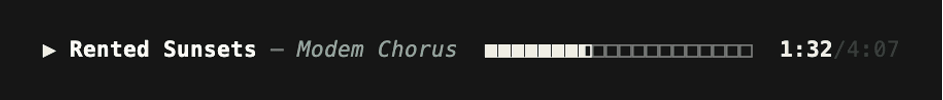

```
/media:config statusline.fields "track,progressbar,time"
/media:config style.progressbar.style tiles
/media:config style.progressbar.playing "#f2efe6"
/media:config style.progressbar.paused "#1e3a34"
/media:config style.track.title "bold #fdfcf8"
/media:config style.track.artist "italic #8fa8a0"
/media:config style.time.elapsed "bold #f2efe6"
/media:config style.time.total "dim #5c6b66"
```

```
▶︎ Rented Sunsets — Modem Chorus  ■■■■■■■◧□□□□□□□□□□□□  1:32/4:07
```

`◧` 不是将就——一排砖本来就以半块砖收尾，所以边界格才有东西可画。

## Telegraph

黄铜与刷了清漆的橡木，边界处的点会变粗、连成划——电报最古老的规矩：
一划不过是三个点连在一起。

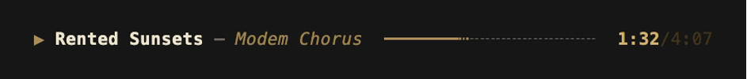

```
/media:config statusline.fields "track,progressbar,time"
/media:config style.progressbar.style dash
/media:config style.progressbar.playing "#b08d57"
/media:config style.progressbar.paused "#6e5327"
/media:config style.track.title "bold #efe6d0"
/media:config style.track.artist "italic #a1854f"
/media:config style.time.elapsed "bold #d4b06a"
/media:config style.time.total "dim #6e5327"
```

```
▶︎ Rented Sunsets — Modem Chorus  ━━━━━━━┅╌╌╌╌╌╌╌╌╌╌╌╌  1:32/4:07
```

## Cassette

温暖的磁带卡座：磁带视窗式进度条、♪ 阶梯音量、奶油与琥珀色的字。

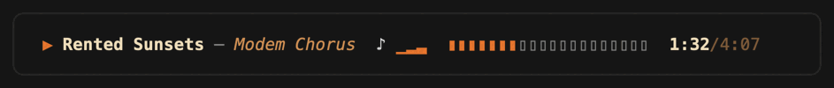

```
/media:config statusline.fields "track,volume,progressbar,time"
/media:config style.progressbar.style cassette
/media:config style.progressbar.playing "#e8863a"
/media:config style.progressbar.paused "#c94f3d"
/media:config style.volume.style stairs
/media:config style.volume.icon ♪
/media:config style.volume.percent off
/media:config style.track.title "bold #f2e3c6"
/media:config style.track.artist "italic #d9a066"
/media:config style.time.elapsed "bold #f2e3c6"
/media:config style.time.total "dim #d9a066"
```

```
▶︎ Rented Sunsets — Modem Chorus  ♪ ▁▂▃  ▮▮▮▮▮▮▮▯▯▯▯▯▯▯▯▯▯▯▯▯  1:32/4:07
```

## Dial

40 格发丝刻度配一根红指针——银面收音机的背光调谐刻度盘，字用冰蓝色。

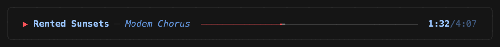

```
/media:config statusline.fields "track,progressbar,time"
/media:config style.progressbar.style playhead
/media:config style.progressbar.length 40
/media:config style.progressbar.playing "#ff6b6b"
/media:config style.progressbar.paused "#e5c25b"
/media:config style.track.title "bold #a9d1ff"
/media:config style.track.artist "italic #6f9fd8"
/media:config style.time.elapsed "bold #a9d1ff"
/media:config style.time.total "dim #6f9fd8"
```

```
▶︎ Rented Sunsets — Modem Chorus  ──────────────╼╾────────────────────────  1:32/4:07
```

## Vernier

淬火钢与黄铜滚轮。游标滑过发丝刻度，停在刻度与刻度*之间*——这正是
游标自 1631 年以来一直在做的事。

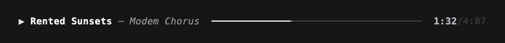

```
/media:config statusline.fields "track,progressbar,time"
/media:config style.progressbar.style glide
/media:config style.progressbar.length 36
/media:config style.progressbar.playing "#dfe4e9"
/media:config style.progressbar.paused "#b08d57"
/media:config style.track.title "bold #eef2f5"
/media:config style.track.artist "italic #8d959e"
/media:config style.time.elapsed "bold #b9bec4"
/media:config style.time.total "dim #5c636a"
```

```
▶︎ Rented Sunsets — Modem Chorus  ━━━━━━━━━━━━━╾──────────────────────  1:32/4:07
```

用 36 而不是 40 是有原因的：`glide` 的游标只在半格位置才会裂成 `╾`，
而在这个位置上，40 格的进度条正好落在整格边界，`╾` 一次都不会出现。

## VFD

暗底上的青绿色段码——90 年代 Hi-Fi 的荧光显示管面板，应用名充当信号源
标签。

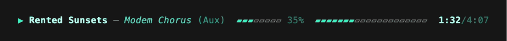

```
/media:config statusline.fields "track,app,volume,progressbar,time"
/media:config style.progressbar.style tape
/media:config style.progressbar.playing "#3ef0c0"
/media:config style.progressbar.paused "#e8a33d"
/media:config style.volume.style progress
/media:config style.volume.icon none
/media:config style.volume.percent "dim #57d9c0"
/media:config style.track.title "bold #b8fff0"
/media:config style.track.artist "italic #57d9c0"
/media:config style.app "#2e9c88"
/media:config style.time.elapsed "bold #b8fff0"
/media:config style.time.total "dim #57d9c0"
```

```
▶︎ Rented Sunsets — Modem Chorus (Aux)  ▰▰▰▱▱▱▱▱ 35%  ▰▰▰▰▰▰▰▱▱▱▱▱▱▱▱▱▱▱▱▱  1:32/4:07
```

## Console

调音台式的双行：上排是电平表和时间码，下排是走带与监听——LED 绿、
录音红。

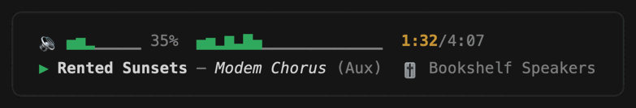

```
/media:config statusline.fields "volume,progressbar,time,/,track,app,output"
/media:config style.progressbar.style eq
/media:config style.progressbar.playing green
/media:config style.progressbar.paused red
/media:config style.volume.style progress
/media:config style.time.elapsed "bold yellow"
/media:config style.output.icon 🎚
```

```
🔉 ▁▄▄▆▄▅▄▇ 35%  ▅▅▅▆▄▄▆▆▆▆▂▂▃▃▅▆▄▅▄▄  1:32/4:07
▶︎ Rented Sunsets — Modem Chorus (Aux)  🎚 Bookshelf Speakers
```

音量小电平表直接借用进度条的 `eq` 字符，因此会跟着一起跳。

## Slider wall

奶油色、黑色，加一段红色顶端——VU 表。指针是故意做慢的，好让它显出
响度，而不是去追每一个瞬态。

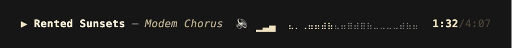

```
/media:config statusline.fields "track,volume,progressbar,time"
/media:config style.progressbar.style bars
/media:config style.progressbar.playing "#f0e3c0"
/media:config style.progressbar.paused "#c44a3d"
/media:config style.volume.style stairs
/media:config style.volume.percent off
/media:config style.track.title "bold #f7efd9"
/media:config style.track.artist "italic #b9a887"
/media:config style.time.elapsed "bold #f0e3c0"
/media:config style.time.total "dim #7d7159"
```

```
▶︎ Rented Sunsets — Modem Chorus  🔉 ▁▂▃  ⣄⡀⢀⣤⣤⣴⣦⣄⣤⣶⣴⣶⣦⣀⣀⣀⣀⣴⣦⣤  1:32/4:07
```

`bars` 的形状由基频加上一个非谐分音和一个次谐波叠成——所以它动起来像
真实节目素材，而不像一个和弦。想要方块高度的版本就用 `eq`，那就是
[Console](#console)。

## Third-octave

红色 LED 柱只在原地跳动，不会横向拉长——三分之一倍频程分析仪。它的
频带中心是固定的，所以条更宽换来的是更多频谱，而不是把同一段看得更宽。

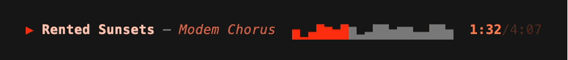

```
/media:config statusline.fields "track,progressbar,time"
/media:config style.progressbar.style spectrum
/media:config style.progressbar.playing "#ff2d10"
/media:config style.progressbar.paused "#8c1f0d"
/media:config style.track.title "bold #ffc2ae"
/media:config style.track.artist "italic #d4654a"
/media:config style.time.elapsed "bold #ff7a45"
/media:config style.time.total "dim #8a3f2a"
```

```
▶︎ Rented Sunsets — Modem Chorus  ▄▁▃▆▅▄▆▅▂▃▆▆▄▅▅▃▃▆▆▄  1:32/4:07
```

这抹红是第一颗可见 LED 自己的颜色——磷砷化镓，655 nm，1962 年。把
`spectrum` 换成 `cava`，同样的分析就用 braille 点阵画出来，横向密度翻倍。

## Seiche

整座湖在它的盆里晃荡——不论盆有多宽，这道驻波都正好装得下。所以这条
进度条无论多长，显示的永远是同样 2.5 个波。

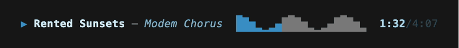

```
/media:config statusline.fields "track,progressbar,time"
/media:config style.progressbar.style wave
/media:config style.progressbar.playing "#3b8fc4"
/media:config style.progressbar.paused "#5f9e79"
/media:config style.track.title "bold #d6ecf5"
/media:config style.track.artist "italic #7fb3cc"
/media:config style.time.elapsed "bold #a5d5ea"
/media:config style.time.total "dim #4a7285"
```

```
▶︎ Rented Sunsets — Modem Chorus  █▇▅▂▁▂▄▇█▇▅▂▁▂▄▇█▇▅▂  1:32/4:07
```

从靛蓝到绿，正是那把湖水色标尺排列的方向——给 seiche 命名的人，也做了
那把标尺。把 `wave` 换成 `swell` 就是它的 braille 孪生。

## Ripple tank

上方一盏灯，下方一盘水，一根针敲在正中——波把自己的影子从中心投向
四周。这台装置当初就是为了证明光是波而造的。

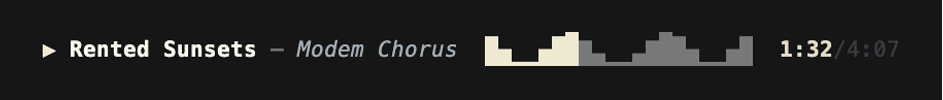

```
/media:config statusline.fields "track,progressbar,time"
/media:config style.progressbar.style mirror
/media:config style.progressbar.playing "#f2ead4"
/media:config style.progressbar.paused "#8a94a6"
/media:config style.track.title "bold #fdfaf0"
/media:config style.track.artist "italic #9fb0c4"
/media:config style.time.elapsed "bold #e8dcbb"
/media:config style.time.total "dim #5c6675"
```

```
▶︎ Rented Sunsets — Modem Chorus  ▇▄▁▁▄▇█▆▃▁▁▃▆█▇▄▁▁▄▇  1:32/4:07
```

同一形状的 braille 孪生是 `ripple`。

## Lead II

每秒 25 毫米走过的描迹——全世界共同约定的走纸速度。所以条越长，得到的
是更多心搏，而不是把一次心搏拉长。

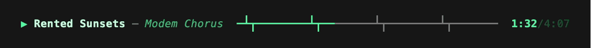

```
/media:config statusline.fields "track,progressbar,time"
/media:config style.progressbar.style heartbeat
/media:config style.progressbar.length 40
/media:config style.progressbar.playing "#55f5a1"
/media:config style.progressbar.paused "#6f8fa8"
/media:config style.track.title "bold #c9fdde"
/media:config style.track.artist "italic #3fbc7b"
/media:config style.time.elapsed "bold #55f5a1"
/media:config style.time.total "dim #2e8f5c"
```

```
▶︎ Rented Sunsets — Modem Chorus  ━┻┳━━━━━━━━┻┳━━━━━━━━┻┳━━━━━━━━┻┳━━━━━━━  1:32/4:07
```

绿色取自长余辉显示管荧光体，而暂停色刻意既不用红也不用黄：在监护仪上
这两种是标准规定的报警色，而暂停的一首歌不是警报。把 `heartbeat` 换成
`monitor` 会用 braille 描迹，行数够多，除了尖峰还能显出小小的 P 波和
T 波隆起；`ekg` 则把心搏从底部往上画，而不是绕着居中的基线。

## Night drive

夜间驾驶的琥珀色仪表辉光——暂停时强调色翻成红色警示灯。

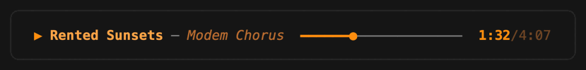

```
/media:config statusline.fields "track,progressbar,time"
/media:config style.progressbar.style knob
/media:config style.progressbar.playing "#ff9f0a"
/media:config style.progressbar.paused "#ff453a"
/media:config style.track.title "bold #ffb257"
/media:config style.track.artist "italic #c77f3d"
/media:config style.time.elapsed "bold #ff9f0a"
/media:config style.time.total "dim #c77f3d"
```

```
▶︎ Rented Sunsets — Modem Chorus  ━━━━━━●─────────────  1:32/4:07
```

## Synthwave

铬青色标题下的亮粉 pulse——霓虹网格落日配色。

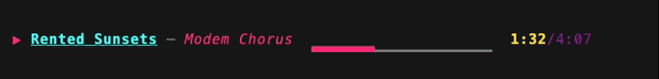

```
/media:config statusline.fields "track,progressbar,time"
/media:config style.progressbar.style pulse
/media:config style.progressbar.playing "#ff2975"
/media:config style.progressbar.paused "#8c1eff"
/media:config style.track.title "bold underline #36f9f6"
/media:config style.track.artist "italic #ff2975"
/media:config style.time.elapsed "bold #ffd319"
/media:config style.time.total "dim #f222ff"
```

```
▶︎ Rented Sunsets — Modem Chorus  ▄▁▁▁▁▁▁█▁▁▄▁▁▁▁▁▁█▁▁  1:32/4:07
```

## Lo-fi

蒙尘的粉彩配一条音符行进的短条——安静、低对比的 study beats。

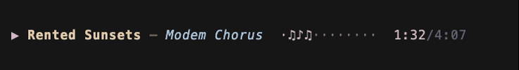

```
/media:config statusline.fields "track,progressbar,time"
/media:config style.progressbar.style notes
/media:config style.progressbar.length 12
/media:config style.progressbar.playing "#d6b2c2"
/media:config style.progressbar.paused "#b7a9c6"
/media:config style.track.title "bold #e4cba8"
/media:config style.track.artist "italic #a4c8e1"
/media:config style.time.elapsed "#d6b2c2"
/media:config style.time.total "dim #b7a9c6"
```

```
▶︎ Rented Sunsets — Modem Chorus  ·♫♪♫··♪♫♪··♫  1:32/4:07
```

## Neko

一只猫沿着点线小路踱步，一身温暖的纸色——终端里的小动物。早在桌面上
有任何东西会走之前，它就已经在命令行上走了。

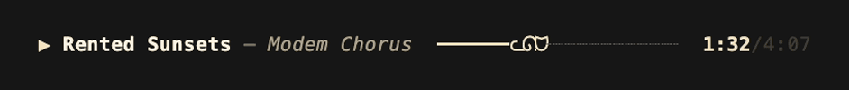

```
/media:config statusline.fields "track,progressbar,time"
/media:config style.progressbar.style cat
/media:config style.progressbar.playing "#f4e4c1"
/media:config style.progressbar.paused "#8a7f6a"
/media:config style.track.title "bold #fbf3e2"
/media:config style.track.artist "italic #b3a488"
/media:config style.time.elapsed "bold #f4e4c1"
/media:config style.time.total "dim #6f6656"
```

```
▶︎ Rented Sunsets — Modem Chorus  ━━━━━━ᓚᘏᗢ┈┈┈┈┈┈┈┈┈┈┈  1:32/4:07
```

`snake`、`duck`、`bird` 各走各的路，`sprite` 则接受你给的任意帧：

```
/media:config style.progressbar.style sprite
/media:config style.progressbar.sprite "◐ ◓ ◑ ◒"
/media:config style.progressbar.trail "═"
/media:config style.progressbar.track "┈"
```

这是唯一完全不需要颜色的一族——轨道走到哪儿，小动物就站在哪儿，光凭
位置就读得出进度。

## Twilight

smooth 条上的靛蓝·长春花·薰衣草粉彩——现代深色主题的粉彩外观。

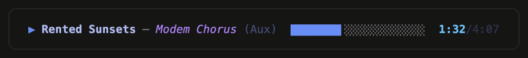

```
/media:config style.progressbar.style smooth
/media:config style.progressbar.playing "#79a0f5"
/media:config style.progressbar.paused "#dfae66"
/media:config style.track.title "bold #bfc9f4"
/media:config style.track.artist "italic #ba99f5"
/media:config style.app "#555e87"
/media:config style.time.elapsed "bold #7bcdfd"
/media:config style.time.total "dim #555e87"
```

```
▶︎ Rented Sunsets — Modem Chorus (Aux)  ███████▌░░░░░░░░░░░░  1:32/4:07
```

没有 truecolor（比如 Apple Terminal）？只把 hex 那几个键换成 named
color 即可——本页任何一款搭配都适用同样的做法：

```
/media:config style.progressbar.playing bright-blue
/media:config style.progressbar.paused yellow
/media:config style.track.title "bold bright-white"
/media:config style.track.artist "italic bright-magenta"
/media:config style.time.elapsed "bold bright-cyan"
/media:config style.app reset
/media:config style.time.total reset
```
