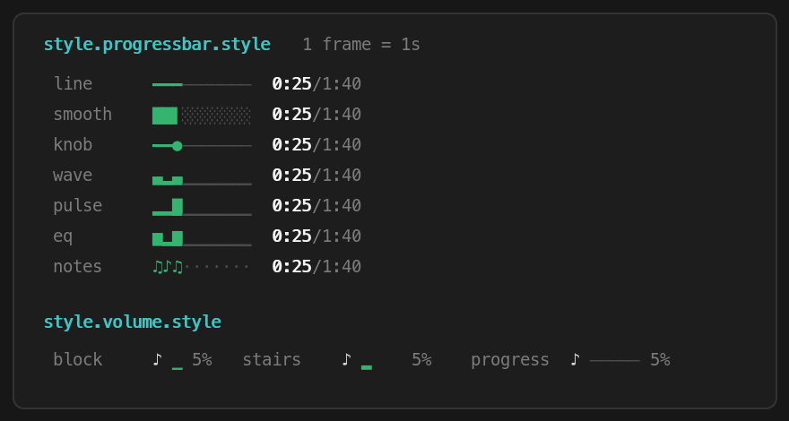

# 状态栏样式图鉴

[English](styles.md) | [한국어](styles.ko.md) | [日本語](styles.ja.md) | **简体中文**

正在播放组件里每一处看得见的细节，都对应一个配置键。这一页把**所有可用的
样式连同实际效果**一次列全。改法有两种：

```
/media:statusline                              # 交互式——或者直接开口：
                                               #   "进度条换成 dots"、"把歌手隐藏"
/media:config style.progressbar.style wave     # 直接设置某个键
```

改动会在下一次状态栏刷新（1 秒内）立即生效，永远不需要重启。运行
`media.sh config style` 可以列出每个键的当前值和默认值。

## 组件解剖图

```
▶︎ Karma Police — Radiohead (Spotify)  🔉 ▄ 45%  ━━━━━━━━━━━━────────  2:13/4:24  🎧 AirPods Pro
```

| 你看到的 | 键 | 默认值 |
| --- | --- | --- |
| `▶︎` / `⏸` 状态图标 | 颜色跟随 `style.progressbar.playing` / `.paused` | `green` / `yellow` |
| `Karma Police` | `style.track.title` | `bold` |
| `— Radiohead` | `style.track.artist` | `italic` |
| `(Spotify)` | `style.app` | `dim` |
| `🔉` 音量图标 | `style.volume.icon` | `auto` |
| `▄` 音量条 | `style.volume.style`（形状） · `style.volume.bar`（显隐） | `block` · `on` |
| `45%` | `style.volume.percent` | `dim` |
| `━━━━━━━━━━━━────────` | `style.progressbar.style`（字符） · `style.progressbar.length`（格数） | `line` · `20` |
| `2:13` 已播时间 | `style.time.elapsed` | `bold` |
| `/4:24` 总时长 | `style.time.total` | `dim` |
| `🎧` 输出图标 | `style.output.icon` | `auto` |
| `AirPods Pro` | `style.output` | `dim` |

（哪些条目出现、排在哪一行，属于*布局*的事——见
[statusline.zh-CN.md](statusline.zh-CN.md)。）

整个组件共用**一种强调色**：▶︎/⏸ 图标、进度条的填充、音量条，播放时都用
`style.progressbar.playing` 的颜色，暂停时都用 `.paused` 的颜色。

## 进度条

字符由 `style.progressbar.style` 决定，宽度由 `style.progressbar.length`
决定（默认 20 格）。`/media:now` 回复里的进度条用同一套字符、同一个长度，
两处永远长得一样。字符和长度在关掉颜色后依然有效。



### 静态预设

按 60% 展示（子格预设用 58%，好让部分字形显出来）：

| 值 | 效果 | |
| --- | --- | --- |
| `line` | `━━━━━━━━━━━━────────` | 默认值 |
| `blocks` | `████████████░░░░░░░░` | 经典款（0.12 之前的默认） |
| `smooth` | `███████████▋░░░░░░░░` | 边界格是部分块——见下文 |
| `rise` | `███████████▅░░░░░░░░` | 边界格自下而上升起——见下文 |
| `fade` | `███████████▓░░░░░░░░` | 边界格由 ▒→▓ 渐深——见下文 |
| `corner` | `███████████▌░░░░░░░░` | 边界格按象限填充——见下文 |
| `glide` | `━━━━━━━━━━━╾────────` | `line` 条的半格步进版——见下文 |
| `stipple` | `⣿⣿⣿⣿⣿⣿⣿⣿⣿⣿⣿⣶⣀⣀⣀⣀⣀⣀⣀⣀` | `braille` 条 + 点阵升起的边界——见下文 |
| `tiles` | `■■■■■■■■■■■◧□□□□□□□□` | 方块 + 半填充边界——见下文 |
| `dash` | `━━━━━━━━━━━┅╌╌╌╌╌╌╌╌` | 虚线轨道上的粗实线；交界处虚线变粗、熔合——见下文 |
| `knob` | `━━━━━━━━━━━●────────` | 滑块头标出填充末端 |
| `playhead` | `───────────╼╾───────` | 细轨道上滑行的粗游标——见下文 |
| `braille` | `⣿⣿⣿⣿⣿⣿⣿⣿⣿⣿⣿⣿⣀⣀⣀⣀⣀⣀⣀⣀` | |
| `chevron` | `▸▸▸▸▸▸▸▸▸▸▸▸▹▹▹▹▹▹▹▹` | |
| `tape` | `▰▰▰▰▰▰▰▰▰▰▰▰▱▱▱▱▱▱▱▱` | |
| `cassette` | `▮▮▮▮▮▮▮▮▮▮▮▮▯▯▯▯▯▯▯▯` | |
| `retro` | `============--------` | 纯 ASCII |
| `dots` | `●●●●●●●●●●●●○○○○○○○○` | |

`smooth` 以 ⅛ 格为步进填充，就算是短歌，秒与秒之间的进度也看得见：

```
 3%  ▋░░░░░░░░░░░░░░░░░░░
47%  █████████▍░░░░░░░░░░
98%  ███████████████████▋
```

`rise` 用同样的 ⅛ 步进自下而上堆高——每一格依次经过 ▁▂▃▄▅▆▇ 再填满：

```
 3%  ▅░░░░░░░░░░░░░░░░░░░
47%  █████████▃░░░░░░░░░░
98%  ███████████████████▅
```

其余六个子格预设走同样的部分边界路径，各有自己的分辨率——fade 为
⅓，corner 为 ¼，stipple 为 ⅙，dash 为 ¼（粗实线沿虚线轨道推进：
交界处虚线先变粗 `╍`，再增密 `┅┉`，最终熔入实线——没有减墨的一步，
所以像 `smooth` 一样连续填满），glide、tiles 为 ½：

```
fade     47%  █████████▒░░░░░░░░░░      98%  ███████████████████▓
corner   46%  █████████▖░░░░░░░░░░      99%  ███████████████████▙
glide    47%  ━━━━━━━━━╾──────────      98%  ━━━━━━━━━━━━━━━━━━━╾
stipple  46%  ⣿⣿⣿⣿⣿⣿⣿⣿⣿⣄⣀⣀⣀⣀⣀⣀⣀⣀⣀⣀      99%  ⣿⣿⣿⣿⣿⣿⣿⣿⣿⣿⣿⣿⣿⣿⣿⣿⣿⣿⣿⣷
tiles    47%  ■■■■■■■■■◧□□□□□□□□□□      98%  ■■■■■■■■■■■■■■■■■■■◧
dash     46%  ━━━━━━━━━╍╌╌╌╌╌╌╌╌╌╌      99%  ━━━━━━━━━━━━━━━━━━━┉
```

`playhead` 不做填充：整条轨道保持细线，一个一格宽的粗游标以与 `glide`
相同的半格步进沿轨道滑行——对齐到格时画 `━`，跨在两格之间时裂成 `╼╾`。
已播放的一侧仍保留强调色，进度依旧一眼可读（关掉颜色时就靠游标本身）：

```
 0%  ━───────────────────
47%  ─────────━──────────
50%  ─────────╼╾─────────
99%  ───────────────────━
```

### 动态预设

这四种在播放时每秒向空端滚动一格，暂停即静止：

| 值 | t | t+1秒 | t+2秒 | |
| --- | --- | --- | --- | --- |
| `wave` | `▂▄▆▄▂▄▆▄▂▄▆▄▁▁▁▁▁▁▁▁` | `▄▂▄▆▄▂▄▆▄▂▄▆▁▁▁▁▁▁▁▁` | `▆▄▂▄▆▄▂▄▆▄▂▄▁▁▁▁▁▁▁▁` | 起伏的波浪 |
| `pulse` | `▂▂█▁▄▂▂█▁▄▂▂▁▁▁▁▁▁▁▁` | `▄▂▂█▁▄▂▂█▁▄▂▁▁▁▁▁▁▁▁` | `▁▄▂▂█▁▄▂▂█▁▄▁▁▁▁▁▁▁▁` | 心电图脉搏 |
| `eq` | `▂▇▃█▅▆▂▇▃█▅▆▁▁▁▁▁▁▁▁` | `▆▂▇▃█▅▆▂▇▃█▅▁▁▁▁▁▁▁▁` | `▅▆▂▇▃█▅▆▂▇▃█▁▁▁▁▁▁▁▁` | 均衡器 |
| `notes` | `♪♫♪♫♪♫♪♫♪♫♪♫········` | `♫♪♫♪♫♪♫♪♫♪♫♪········` | `♪♫♪♫♪♫♪♫♪♫♪♫········` | 行进的音符 |

### 自定义字符

给**恰好两个字符**就是"填充 + 空白"（空白那格可以用空格；两个空格、
制表符和换行会被拒绝）：

```
/media:config style.progressbar.style "#-"     →  ############--------
/media:config style.progressbar.style "~ "     →  ~~~~~~~~~~~~
```

### 进度条长度

`style.progressbar.length` 决定进度条占多少格——1 到 60 之间的整数，
默认 `20`：

```
/media:config style.progressbar.length 10   →  ━━━━━━────
/media:config style.progressbar.length 40   →  ━━━━━━━━━━━━━━━━━━━━━━━━────────────────
```

一个长度同时管两处——状态栏组件和 `/media:now` 的回复。链接开着时每一格
照样可以 ⌘+点击，条越长，跳转的步进就越细。（音量迷你条每级音量一格，
固定 8 格。）默认值在 0.20.0 从 10 格加宽到 20 格——设回 `10` 就是
从前那根紧凑的条。

### 进度条颜色

`style.progressbar.playing`（默认 `green`）和 `.paused`（默认 `yellow`）
决定填充的颜色——组件共用一种强调色，所以 ▶︎/⏸ 图标和音量条会一起变。
空格子始终保持暗淡（dim）。

```
/media:config style.progressbar.playing bright-cyan
/media:config style.progressbar.playing "#1db954"   # 任何十六进制颜色都行
/media:config style.progressbar.paused magenta
```

## 音量

`volume` 条目按**图标 + 音量条 + 百分比**（`🔉 ▄ 45%`）渲染，静音时收拢成
一个 `🔇`。（需要 native helper——见 `/media:doctor`。）

### 音量条形状 — `style.volume.style`

| 值 | 10% | 20% | 35% | 50% | 60% | 75% | 85% | 100% | |
| --- | --- | --- | --- | --- | --- | --- | --- | --- | --- |
| `block` | `▁` | `▂` | `▃` | `▄` | `▅` | `▆` | `▇` | `█` | 单格，高度随音量（默认） |
| `stairs` | `▁` | `▁▂` | `▁▂▃` | `▁▂▃▄` | `▁▂▃▄▅` | `▁▂▃▄▅▆` | `▁▂▃▄▅▆▇` | `▁▂▃▄▅▆▇█` | 八级台阶 |
| `progress` | `━───────` | `━━──────` | `━━━─────` | `━━━━────` | `━━━━━───` | `━━━━━━──` | `━━━━━━━─` | `━━━━━━━━` | 8 格迷你条 |

`progress` 用你进度条的那套字符来画——连动画都一样。`blocks` 画出
`████░░░░`，`dots` 画出 `●●●●○○○○`。音量条的颜色永远跟随播放/暂停强调色；
`style.volume.bar off` 只隐藏这根条（`🔉 45%`）。

### 音量图标 — `style.volume.icon`

| 值 | 效果 |
| --- | --- |
| `auto`（默认） | `🔈` 低 · `🔉` 中 · `🔊` 高 · 为零时 `🔇` |
| `none` | 隐藏——`▄ 45%` |
| 任意字符，如 `♪` | `♪ ▄ 45%` |

静音时无论图标怎么设，都只显示 `🔇`。

### 百分比 — `style.volume.percent`

接受文本样式（默认 `dim`），设为 `off` 则去掉：`🔉 ▄`。

## 输出设备

`output` 条目是图标 + 设备名：`🎧 AirPods Pro`。

| 键 | 值 |
| --- | --- |
| `style.output.icon` | `auto`（默认）= 按设备类型：`🎧` 蓝牙和耳机孔 · `📺` HDMI/DisplayPort · `📶` AirPlay · `🔊` 扬声器——或 `none`，或任意字符 |
| `style.output` | 设备名的文本样式（默认 `dim`），`off` 则只留图标 |

## 文本样式

所有文本部分——曲名、歌手、应用、已播/总时长、音量百分比、输出设备名——
都接受**样式说明**：

- `bold`、`dim`、`italic`、`underline` 任意组合
- 颜色至多一种：`black` `red` `green` `yellow` `blue` `magenta` `cyan`
  `white`，`bright-<颜色>`（实际色调由你终端的调色板决定），或一个精确的
  十六进制色号——`#ff8800`，短写 `#f80`——按 24 位真彩色渲染
  （多数终端支持；Apple Terminal 不支持）
- 或 `none`——完全不加样式
- 或 `off`——**隐藏这一部分**

```
/media:config style.track.title "bold bright-cyan"
/media:config style.track.title "bold #ff8800"   # 精确颜色——hex 要加引号
/media:config style.track.artist off
```

隐藏会顺手收拾干净：隐藏曲名，`—` 分隔符跟着消失；隐藏已播时间，总时长
前面的 `/` 也消失；一个条目的所有部分都被隐藏，整个条目就不再出现。
（想去掉整个条目，改布局才是正路——`/media:statusline`。）

样式说明只在 `statusline.color` 开着时渲染（`NO_COLOR` 永远优先）。改字符
的那些——进度条字符、音量条形状、图标——以及 `off`，不管颜色开没开都生效。

## 现成搭配

即贴即用的整套外观——荧光体终端、磁带卡座、调音台、synthwave 霓虹等——
已移到专门页面，每款附 GIF、精确的 config 块和纯文本预览：
**[docs/recipes.zh-CN.md](recipes.zh-CN.md)**。

## 恢复默认

```
/media:config style.track.title reset     # 只重置一个键
/media:config style reset                 # 所有 style.* 键
/media:config statusline reset            # 样式 + 布局、分行、颜色、
                                          # marquee——整体回到出厂外观
```
